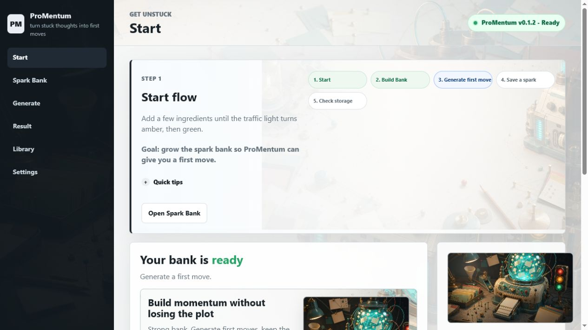
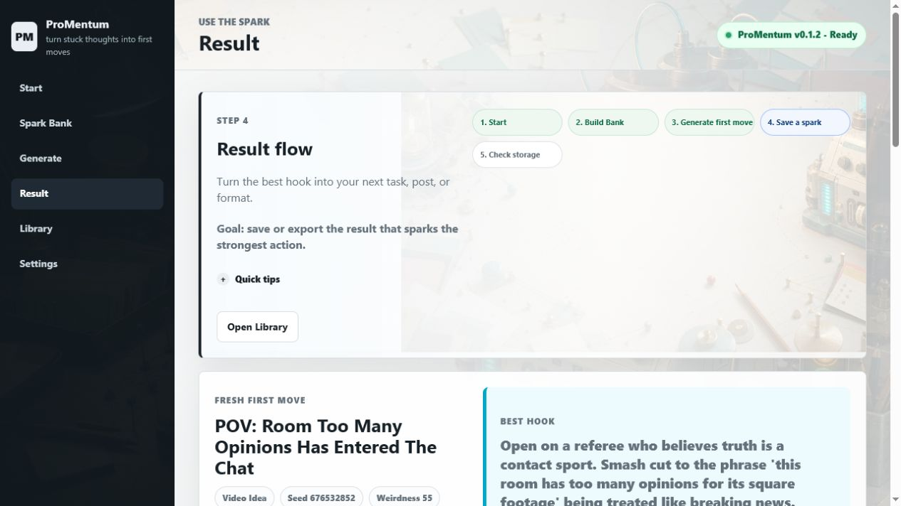

# ProMentum

**Turn stuck thoughts into first moves.**

Welcome to ProMentum. It is a local-first creative spark tool for the moment
where you have ideas, scraps, phrases, people, places, obsessions, half-jokes,
and no obvious next step. Feed it your raw material, press **Generate First
Move**, and it turns the mess into repeatable hooks, scene seeds, titles,
formats, and tiny next actions.

No API keys. No cloud calls. No accounts. No npm. No build step.

[Download the latest Windows ZIP](https://github.com/Martin123132/ProMentum/releases/latest)

Here it is on first launch:



## Quick Start

1. Download the `ProMentum-vX.Y.Z.zip` file from the latest release.
2. Unzip it somewhere normal, such as your Desktop or D: drive.
3. Double-click `START_ProMentum_WINDOWS.bat`.
4. Your browser opens locally.
5. Press **Generate First Move**.

If Windows says Python is missing, install Python 3.10 or newer from:

```text
https://www.python.org/downloads/windows/
```

Tick `Add python.exe to PATH` during install, then double-click the launcher
again.

## What It Feels Like

ProMentum is built around movement, not menus. Each page has one job, and the
traffic-light system tells you what to do next:

- **Red**: add more raw material.
- **Amber**: you can try a first move.
- **Green**: generate, save, export, and keep going.

It is meant to feel playful but useful: a small local machine that helps you
get unstuck without turning your own thoughts into a cloud service.



## What You Can Do

- Build a **Spark Bank** of ideas, phrases, people, places, questions, formats, and rules.
- Generate hooks, titles, scene seeds, short-form ideas, and concept mashups.
- Lock a seed so the same input gives the same result again.
- Raise or lower weirdness depending on whether you want grounded or chaotic.
- Save favourites locally.
- Export TXT or HTML files.
- Open your data and exports folders from inside the app.

## Why Local First

ProMentum is deliberately small and boring under the hood:

- It runs on `127.0.0.1` in your browser.
- It saves data on your own machine.
- It does not call OpenAI, Claude, Ollama, or any other model provider.
- It does not need payment details, login details, telemetry, or internet access.

By default on Windows, local data goes to `D:\ProMentumData` when D: exists.
If D: is missing, ProMentum uses the portable `promentum_data` folder beside the
app. You can set `PROMENTUM_HOME` to choose another folder.

## Screenshots And Artwork

The app ships with its own ProMentum artwork for the workshop background,
generator console, Spark Bank bench, and saved-sparks shelf. Those images are
bundled in the release ZIP with the README screenshots above, so what you see
on GitHub is the same local app people open on Windows.

## Pages

- `Start`: traffic lights, quick add, and the next useful move.
- `Spark Bank`: edit the raw ingredients that make the output feel like yours.
- `Generate`: choose mode, seed, weirdness, and ingredient count.
- `Result`: read the generated spark, copy it, shape it, save it, or export it.
- `Library`: reload favourites you want to keep.
- `Settings`: check local storage and open data folders.

## For Testers

Try this simple loop:

1. Add one strange ingredient to the Spark Bank.
2. Generate a first move.
3. Save a favourite.
4. Export TXT.
5. Close the app and reopen it.
6. Check that your bank and favourite are still there.

Good tester notes are plain:

- How long did it take to get the first result?
- Did Python block you?
- Did the launcher make sense?
- Did save/export make sense?
- Which seed or mode made you grin?

## Development

For local development on D: use:

```powershell
New-Item -ItemType Directory -Force -Path D:\Temp, D:\ProMentumData | Out-Null
$env:TEMP = "D:\Temp"
$env:TMP = "D:\Temp"
$env:PROMENTUM_HOME = "D:\ProMentumData"
python -m idea_collider_app.app
```

Useful checks:

```powershell
python -m unittest discover -s tests
python -m compileall idea_collider_app tests scripts
python scripts\sample_collisions.py --count 5
python -m idea_collider_app.app --doctor
```

The fixed demo bench lives in `docs\demo-bench`:

```powershell
python scripts\sample_collisions.py --demo --count 28 --output-dir docs\demo-bench
```

Before handing the machine back to other agents, stop any local ProMentum server:

```powershell
powershell -ExecutionPolicy Bypass -File scripts\stop_dev_processes.ps1
```

## Release ZIP

Maintainers can build and verify a clean local ZIP with:

```powershell
New-Item -ItemType Directory -Force -Path D:\Temp, D:\ProMentumData, D:\ProMentumVerifyWork | Out-Null
$env:TEMP = "D:\Temp"
$env:TMP = "D:\Temp"
$env:PROMENTUM_HOME = "D:\ProMentumData"
powershell -ExecutionPolicy Bypass -File scripts\make_release_zip.ps1
$zip = (Get-ChildItem dist\ProMentum-v*.zip | Sort-Object LastWriteTime -Descending | Select-Object -First 1).FullName
powershell -ExecutionPolicy Bypass -File scripts\verify_release_zip.ps1 -ZipPath $zip -WorkRoot D:\ProMentumVerifyWork
```

The ZIP includes the app, docs, demo bench, and README screenshots. It excludes
runtime data, caches, and temporary build folders.

## Licence

ProMentum is source-available for personal and non-commercial use under the
PolyForm Noncommercial License 1.0.0. Commercial use requires a separate
written licence from the licensor. See `LICENSE`.
